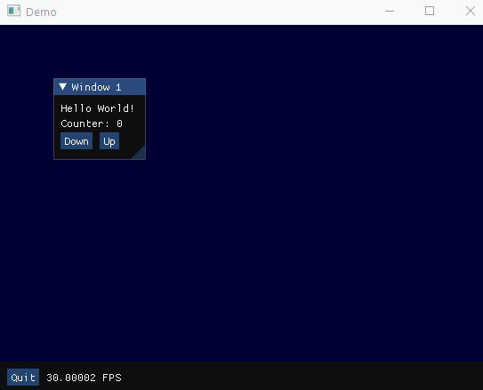

# ImGui.NET FSharp Wrapper

Build rapid GUI applications in FSharp using the excellent [Dear ImGui](https://github.com/ocornut/imgui) via the [ImGui.NET](https://github.com/mellinoe/ImGui.NET) wrapper.

## Why?

Because it should be very easy to knock up and iterate on a simple UI with minimal dependencies and ceremony. No companion C# project with Xaml, no web servers, browsers and Javascript bundles. Just some functions that compose nicely and work largely as expected.

## How?

How about a quick little GUI window from your FSI session?

```fsharp
let commonStatusBar() = 
    Gui.statusBar "Status Bar" [
        Gui.button "Quit" closeGui
        Gui.text $"{ImGui.GetIO().Framerate} FPS"
    ]()

let counter = ref 0
let incr i = fun _ -> counter := !counter + i
let decr i = fun _ -> counter := !counter - i

let page() = 
    Gui.app [
        Gui.window "Window 1" [
            Gui.text "Hello World!"
            Gui.text $"Counter: {!counter}"
            Gui.button "Down" (decr 1) ++ Gui.button "Up" (incr 1)
        ]

        commonStatusBar
    ]()

startOrUpdateGuiWith "Demo" page
```



### Hot Reloading

How about hot reloading some changes as you rapidly iterate?

```fsharp
let newPage()  = 
    Gui.app [
        Gui.window "Updated!" [
            Gui.text "Updated!"
        ]

        commonStatusBar
    ]()

setGuiBuilder newPage
```

And boom!


### Elmish

More complex apps might benefit from the MVU architecture of Elmish. I didn't want to pollute this repo with dependencies on Elmish, but turns out that's not needed.

The normal Elmish message, model, update, init components:

```fsharp
type Model = {
    Value: int
    Checkbox: bool
}

type Msg = 
    | Incr of int
    | Decr of int
    | Checked of bool

let update (msg:Msg) (model:Model) = 
    match msg with
    | Incr(amount) ->  { model with Value = model.Value + amount }, Cmd.none
    | Decr(amount) ->  { model with Value = model.Value - amount }, Cmd.none
    | Checked(flag) -> {model with Checkbox = flag}, Cmd.none

let init () = 
    {
        Value = 0
        Checkbox = false
    }, Cmd.none
```

And _optional_ viewmodel and model to viewmodel mapper to ensure model changes flow into the UI and ensure no messy two-way data binding as per the MVU way:

```fsharp
let viewModel = {|
    Checkbox = ref false
    ValueString = ref ""
|}

let mapModelToViewModel (model:Model) = 
    viewModel.Checkbox := model.Checkbox
    viewModel.ValueString := model.Value.ToString()
```

And then of course the view itself:

```fsharp
let view (model:Model) (dispatch:Msg -> unit) = 
    mapModelToViewModel model

    let gui = 
        Gui.app [
            Gui.window "Demo" [
                Gui.sameLine [
                    Gui.text !viewModel.ValueString
                    Gui.button "+" (fun () -> Incr 1 |> dispatch )
                    Gui.button "-" (fun () -> Decr 1 |> dispatch )
                ] |> Gui.alignText

                Gui.checkbox "Test" viewModel.Checkbox (Checked >> dispatch)
            ]
        ]

    startOrUpdateGuiWith "Demo" gui |> ignore
```

Wire up with some helper function to ensure dispatching on GUI thread and away we go:

```fsharp
let guiDispatch innerDispatch = 
    fun msg -> dispatchToGui (fun () -> innerDispatch msg)

Program.mkProgram init update view
|> Program.withSyncDispatch guiDispatch
|> Program.run
```

### More!

Explore some other samples in the [Samples Project](src/ImGui.NET.FSharp.Sample/Program.fs).